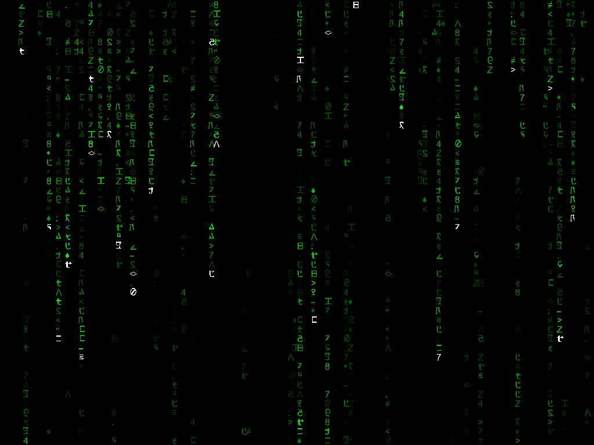



## Realistic Matrix ScreenSaver without using DirectX

### Description

This is a very realistic Matrix falling code style screensaver but without the need of using DirectX...
 
### More Info
 

             |
---                |---
**Submitted On**   |2002-04-14 13:33:12
**By**             |[Kevin Pfister](https://github.com/Planet-Source-Code/PSCIndex/blob/master/ByAuthor/kevin-pfister.md)
**Level**          |Intermediate
**User Rating**    |4.7 (42 globes from 9 users)
**Compatibility**  |VB 6\.0
**Category**       |[Graphics](https://github.com/Planet-Source-Code/PSCIndex/blob/master/ByCategory/graphics__1-46.md)
**World**          |[Visual Basic](https://github.com/Planet-Source-Code/PSCIndex/blob/master/ByWorld/visual-basic.md)
**Archive File**   |[Matrix\_Scr718854142002\.zip](https://github.com/Planet-Source-Code/kevin-pfister-realistic-matrix-screensaver-without-using-directx__1-33795/archive/master.zip)

